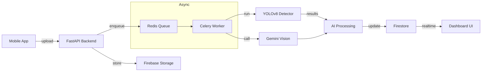

# CitySense — AI-Powered Civic Intelligence Platform for Smart Cities

CitySense is a full-stack AI-powered civic intelligence platform designed to modernize urban issue reporting and monitoring workflows. The platform enables citizens to report infrastructure and public safety issues in real time using a mobile application, while providing municipal authorities with an intelligent analytics dashboard for monitoring, prioritization, and decision-making.

---

## Key Features

### AI-Powered Civic Issue Detection

* Custom-trained YOLOv8 multi-class object detection model for:

  * potholes
  * garbage accumulation
  * road damage
* Confidence-based detection filtering for improved reliability.
* Hybrid AI architecture combining Computer Vision + LLM reasoning.

### Realtime Civic Monitoring Dashboard

* Interactive web dashboard with:

  * live issue feed
  * map visualization
  * analytics charts
  * report monitoring tables
  * realtime Firestore updates

### Mobile Citizen Reporting Application

* Cross-platform React Native mobile app.
* Image capture and gallery upload support.
* GPS-enabled issue reporting.

---

## System Architecture

```text
        Mobile App 
            ↓
       FastAPI Backend
            ↓
 Firebase Storage + Firestore
      ↓
     Redis Queue
      ↓
    Celery Worker
      ↓
   YOLOv8 + Gemini Processing
      ↓
 Firebase Firestore Status Updates
      ↓
  Realtime Monitoring Dashboard
```

---

## Problem statement

Urban authorities and citizens tools to detect, report, and prioritize civic issues. Manual reporting is slow and often lacks the contextual needed to prioritize responses.

## Architecture diagram



## Tech stack

- Backend: `FastAPI`, `Python`
- Queue & Workers: `Redis`, `Celery`
- Storage & Realtime DB: `Firebase Storage`, `Firestore`
- AI Models: `YOLOv8` (object detection), `Gemini` (vision reasoning)
- Frontend Dashboard: `React`
- Mobile: `React Native`
- Containerization: `Docker`, `docker-compose`

## AI pipeline explanation

1. User uploads an image via the mobile app; the backend stores the file in Firebase Storage and creates a lightweight report record in Firestore.
2. The backend enqueues a processing job (image path + metadata) onto Redis.
3. Celery workers pick up the job and run the YOLOv8 detector to locate and classify issues in the image.
4. Detection outputs are passed to the `AI Processing Service`, which calls the Gemini LLM to enrich the findings (generate human-friendly summaries, infer severity, or add remediation suggestions).
5. The enriched report (detections + LLM summary) is written back to Firestore and surfaced to the realtime dashboard.

## Async queue explanation

The system uses Redis as a durable broker and Celery as the worker framework to ensure asynchronous, scalable processing:

- Jobs are enqueued by the FastAPI backend immediately after upload, keeping request latency low.
- Celery workers can be horizontally scaled to handle bursts of incoming reports.
- Retries and exponential backoff are configured for transient failures; critical failures are logged and surfaced to administrators.
- This design decouples ingestion from heavy model inference, improving frontend responsiveness and overall system reliability.


## Future improvements

- Add automated prioritization and SLA-based routing for issues.
- On-device lightweight detection to reduce bandwidth and cost.
- Active learning loop: periodically retrain YOLO model from verified reports.
- Role-based access controls and incident assignment workflows.
- Add end-to-end tests and CI to validate model inference and pipeline integrity.

